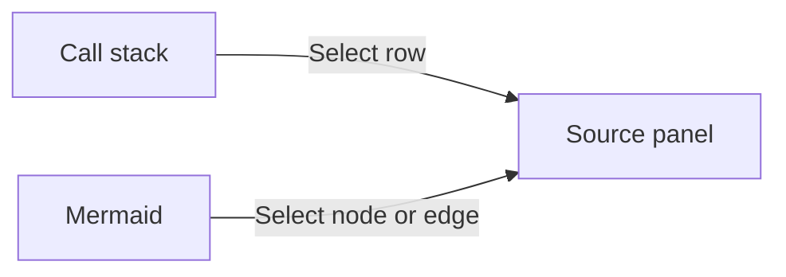
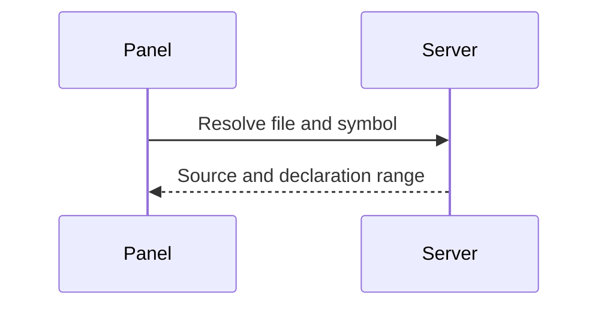
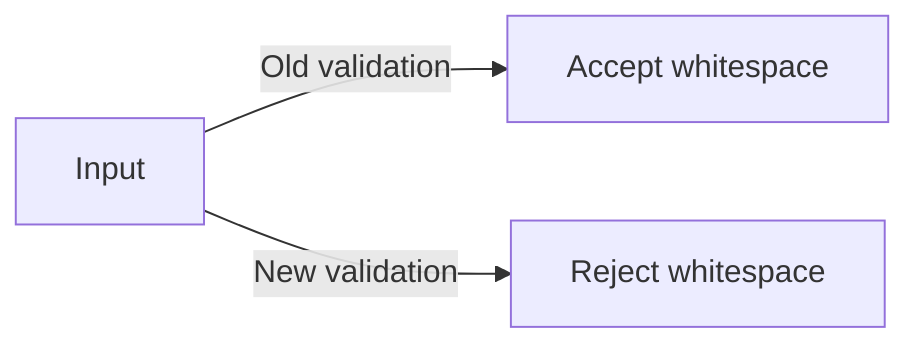

# Symbol and diagram references

Run from the repository root. These references read the current TK Stack source.

```callstack
 parseViewerDocument [[packages/tkstack/src/parseViewer.ts#parseViewerDocument]]
 └── parseFence [[packages/tkstack/src/parseFence.ts#parseFence]]
     ├── parseCallStack [[packages/tkstack/src/annotations.ts#parseCallStack]]
     └── parseDiagramAnnotations [[packages/tkstack/src/diagramAnnotations.ts#parseDiagramAnnotations]]
```

## The shared source panel

Click a node, connecting line, or line label. Tab and Enter or Space also work.





## Embedded old and new changes

These sample patches are snapshots; their files do not need to exist locally.



```source-diff:validation:src/validation.ts
diff --git a/src/validation.ts b/src/validation.ts
--- a/src/validation.ts
+++ b/src/validation.ts
@@ -1,3 +1,3 @@
 export function validateInput(input: string) {
-  return input.length > 0;
+  return input.trim().length > 0;
 }
```
