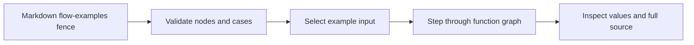

# Interactive flow examples

## System flow



## Problem overview

The existing call stack and diff views explain a PR's structure, but a reader must mentally simulate each input. That makes it hard to see when two cases branch or how a value changes between functions.

## Solution overview

An author can embed a `flow-examples` JSON fence in a walkthrough. It declares a small function graph and concrete cases. The viewer starts at the function level; the reader selects a case, moves through its recorded steps, sees input and output values, and opens the source for a node. This experiment uses authored traces. A future test recorder can emit the same data shape.

## Goals

- Let a reader compare multiple concrete inputs and their different paths.
- Show the active function, value transition, and result at each step.
- Keep full source one click away through the existing source panel.
- Make the fence usable in local, gist, and GitHub viewers.

## Non-goals

- Running arbitrary repository code in the browser.
- Automatically generating traces from tests in this iteration.
- Line-by-line debugger state.

## Important files

- [[flow-parser:new:23-142]] — Validates the authored example format.
- [[flow-fence:new:28-38]] — Renders fences in the document.
- [[src/viewer/SourceDiffPanel.tsx#SourceDiffPanel]] — Opens the full source behind a node.
- [[fixtures/deterministic-simulation-flow.md]] — Demo using Tandem's deterministic simulation spec.

## Implementation

### Phase 1: Define the authoring format

Parse one graph and several example traces from a fenced JSON block. Reject broken node paths or source references before sharing a document.

```callstack
 parseViewerDocument [[src/parseViewer.ts#parseViewerDocument]]
+├── parseFence("flow-examples") [[src/parseFence.ts#parseFence]]
+│   └── parseFlowExamples [[flow-parser:new:23-142]]
 └── validate source references
```

- [x] Add nodes, cases, step values, and source references.
- [x] Validate duplicate ids and broken paths.
- [x] Test parsing and document integration.

### Phase 2: Render the interactive review

Show a case picker, function graph, current transition, and playback controls. Node source links use the current Diff panel, which shows full code.

```callstack
 Fence [[flow-fence:new:28-38]]
+└── FlowExamplesView [[flow-ui:new:9-219]]
    ├── choose case → first step
    ├── move through steps → highlight graph and values
    └── open node source → SourceDiffPanel [[src/viewer/SourceDiffPanel.tsx#SourceDiffPanel]]
```

- [x] Build the viewer and responsive layout.
- [x] Add a Tandem simulation example with two recorded failure paths that branch at the network fault.
- [x] Verify the build and inspect case switching, step navigation, and full code in a browser.

## Source changes

The diff panel holds the landed implementation behind the annotated stacks.

```source-diff:flow-parser:src/flowExamples.ts
diff --git a/src/flowExamples.ts b/src/flowExamples.ts
new file mode 100644
index 0000000..1f6fc78
--- /dev/null
+++ b/src/flowExamples.ts
@@ -0,0 +1,142 @@
+import { parseAnnotation, type SourceAnnotation } from "./annotations.js";
+
+export type FlowNode = {
+  id: string;
+  label: string;
+  summary: string;
+  source?: SourceAnnotation;
+};
+
+export type FlowStep = {
+  node: string;
+  title: string;
+  detail?: string;
+  input?: unknown;
+  output?: unknown;
+};
+
+export type FlowCase = {
+  id: string;
+  label: string;
+  input: unknown;
+  steps: FlowStep[];
+  result: unknown;
+};
+
+export type FlowExamples = {
+  title: string;
+  description?: string;
+  nodes: FlowNode[];
+  cases: FlowCase[];
+};
+
+export function parseFlowExamples(source: string): FlowExamples | Error {
+  let value: unknown;
+  try {
+    value = JSON.parse(source);
+  } catch (cause) {
+    return new Error(`Invalid flow-examples JSON: ${String(cause)}`);
+  }
+  if (!record(value) || !nonempty(value.title))
+    return new Error("flow-examples needs a title.");
+  if (value.description !== undefined && typeof value.description !== "string")
+    return new Error("flow-examples description must be text.");
+  if (!Array.isArray(value.nodes) || value.nodes.length === 0)
+    return new Error("flow-examples needs at least one node.");
+  if (!Array.isArray(value.cases) || value.cases.length === 0)
+    return new Error("flow-examples needs at least one case.");
+
+  const nodes: FlowNode[] = [];
+  const nodeIds = new Set<string>();
+  for (const [index, raw] of value.nodes.entries()) {
+    if (
+      !record(raw) ||
+      !nonempty(raw.id) ||
+      !nonempty(raw.label) ||
+      !nonempty(raw.summary)
+    )
+      return new Error(
+        `flow-examples node ${index + 1} needs id, label, and summary.`,
+      );
+    if (nodeIds.has(raw.id))
+      return new Error(`Duplicate flow node "${raw.id}".`);
+    nodeIds.add(raw.id);
+    let annotation: SourceAnnotation | undefined;
+    if (raw.source !== undefined) {
+      if (typeof raw.source !== "string")
+        return new Error(`flow-examples node "${raw.id}" source must be text.`);
+      annotation = parseAnnotation(raw.source);
+      if (annotation.references.length !== 1 || annotation.text.trim() !== "")
+        return new Error(
+          `flow-examples node "${raw.id}" needs one [[source reference]].`,
+        );
+    }
+    nodes.push({
+      id: raw.id,
+      label: raw.label,
+      summary: raw.summary,
+      source: annotation,
+    });
+  }
+
+  const cases: FlowCase[] = [];
+  const caseIds = new Set<string>();
+  for (const [index, raw] of value.cases.entries()) {
+    if (
+      !record(raw) ||
+      !nonempty(raw.id) ||
+      !nonempty(raw.label) ||
+      !has(raw, "input") ||
+      !has(raw, "result")
+    )
+      return new Error(
+        `flow-examples case ${index + 1} needs id, label, input, and result.`,
+      );
+    if (caseIds.has(raw.id))
+      return new Error(`Duplicate flow case "${raw.id}".`);
+    caseIds.add(raw.id);
+    if (!Array.isArray(raw.steps) || raw.steps.length === 0)
+      return new Error(`flow-examples case "${raw.id}" needs steps.`);
+    const steps: FlowStep[] = [];
+    for (const [stepIndex, step] of raw.steps.entries()) {
+      if (
+        !record(step) ||
+        !nonempty(step.node) ||
+        !nonempty(step.title) ||
+        !nodeIds.has(step.node)
+      )
+        return new Error(
+          `Invalid step ${stepIndex + 1} in flow case "${raw.id}".`,
+        );
+      if (step.detail !== undefined && typeof step.detail !== "string")
+        return new Error(`Step ${stepIndex + 1} detail must be text.`);
+      steps.push({
+        node: step.node,
+        title: step.title,
+        detail: step.detail,
+        ...(has(step, "input") ? { input: step.input } : {}),
+        ...(has(step, "output") ? { output: step.output } : {}),
+      });
+    }
+    cases.push({
+      id: raw.id,
+      label: raw.label,
+      input: raw.input,
+      steps,
+      result: raw.result,
+    });
+  }
+  return { title: value.title, description: value.description, nodes, cases };
+}
+
+function record(value: unknown): value is Record<string, unknown> {
+  return typeof value === "object" && value !== null && !Array.isArray(value);
+}
+
+function nonempty(value: unknown): value is string {
+  return typeof value === "string" && value.trim().length > 0;
+}
+
+function has(value: Record<string, unknown>, key: string): boolean {
+  return Object.hasOwn(value, key);
+}
```

```source-diff:flow-fence:src/viewer/Fence.tsx
diff --git a/src/viewer/Fence.tsx b/src/viewer/Fence.tsx
index e21a7d5..cbee73c 100644
--- a/src/viewer/Fence.tsx
+++ b/src/viewer/Fence.tsx
@@ -4,6 +4,7 @@ import type { SourceNavigation } from "../annotations.js";
 import { CallStackDiff } from "./CallStackDiff.tsx";
 import { CodeDiff } from "./CodeDiff.tsx";
 import { FileExcerpt } from "./FileExcerpt.tsx";
+import { FlowExamplesView } from "./FlowExamplesView.tsx";
 import { HtmlBlock } from "./HtmlBlock.tsx";
 import { HtmlPlaceholder } from "./HtmlPlaceholder.tsx";
 import { MermaidBlock } from "./MermaidBlock.tsx";
@@ -27,7 +28,11 @@ export function Fence(props: { fence: FenceModel } & SourceNavigation) {
   }
   if (fence.kind === "source-diff") return undefined;
   if (fence.kind === "flow-examples")
-    return <CodeBlock lang="json">{fence.source}</CodeBlock>;
+    return fence.flow instanceof Error ? (
+      <CodeBlock lang="text">{fence.flow.message}</CodeBlock>
+    ) : (
+      <FlowExamplesView flow={fence.flow} {...props} />
+    );
   if (fence.kind === "callstack")
     return (
       <CallStackDiff
```

```source-diff:flow-ui:src/viewer/FlowExamplesView.tsx
diff --git a/src/viewer/FlowExamplesView.tsx b/src/viewer/FlowExamplesView.tsx
new file mode 100644
index 0000000..dfc2105
--- /dev/null
+++ b/src/viewer/FlowExamplesView.tsx
@@ -0,0 +1,514 @@
+import { useEffect, useMemo, useRef, useState } from "react";
+import { colors, backgroundColor, borderColor, focusRing, text } from "maui";
+import { style, useStyles } from "purse-styles";
+import type { SourceNavigation } from "../annotations.js";
+import { codeFontFamily } from "../codeFont.js";
+import type { FlowExamples } from "../flowExamples.js";
+
+export function FlowExamplesView(
+  props: { flow: FlowExamples } & SourceNavigation,
+) {
+  const [caseIndex, setCaseIndex] = useState(0);
+  const [stepIndex, setStepIndex] = useState(0);
+  const [playing, setPlaying] = useState(false);
+  const graphRef = useRef<HTMLDivElement>(null);
+  const flowCase = props.flow.cases[caseIndex]!;
+  const step = flowCase.steps[stepIndex]!;
+  const node = props.flow.nodes.find((entry) => entry.id === step.node)!;
+  const shell = useStyles(styles.shell);
+  const header = useStyles(styles.header);
+  const tabs = useStyles(styles.tabs);
+  const tab = useStyles(styles.tab);
+  const graph = useStyles(styles.graph);
+  const graphNode = useStyles(styles.graphNode);
+  const detail = useStyles(styles.detail);
+  const controls = useStyles(styles.controls);
+  const control = useStyles(styles.control);
+  const sourceButton = useStyles(styles.sourceButton);
+  const value = useStyles(styles.value);
+  const path = useMemo(
+    () =>
+      flowCase.steps.map((item) =>
+        props.flow.nodes.find((entry) => entry.id === item.node)!,
+      ),
+    [flowCase, props.flow.nodes],
+  );
+
+  useEffect(() => {
+    if (!playing) return;
+    if (stepIndex >= flowCase.steps.length - 1) return;
+    const timer = window.setTimeout(() => {
+      setStepIndex((current) => current + 1);
+      if (stepIndex === flowCase.steps.length - 2) setPlaying(false);
+    }, 1150);
+    return () => window.clearTimeout(timer);
+  }, [playing, stepIndex, flowCase.steps.length]);
+
+  useEffect(() => {
+    const container = graphRef.current;
+    const active = container?.querySelector<HTMLElement>(
+      `[data-flow-index='${stepIndex}']`,
+    );
+    if (!container || !active || container.dataset.caseId !== flowCase.id)
+      return;
+    const outer = container.getBoundingClientRect();
+    const inner = active.getBoundingClientRect();
+    container.scrollBy({
+      left: inner.left - outer.left - outer.width / 2 + inner.width / 2,
+      behavior: "smooth",
+    });
+  }, [stepIndex, flowCase.id]);
+
+  function chooseCase(index: number) {
+    setCaseIndex(index);
+    setStepIndex(0);
+    setPlaying(false);
+  }
+
+  function chooseStep(index: number) {
+    setStepIndex(index);
+    setPlaying(false);
+  }
+
+  function next() {
+    if (stepIndex === flowCase.steps.length - 1) {
+      setStepIndex(0);
+    } else {
+      setStepIndex(stepIndex + 1);
+    }
+    setPlaying(false);
+  }
+
+  return (
+    <section
+      className={shell}
+      data-diffmap-kind="flow-examples"
+      aria-label={props.flow.title}
+    >
+      <div className={header}>
+        <div>
+          <span className="flow-eyebrow">INTERACTIVE EXAMPLE</span>
+          <h3>{props.flow.title}</h3>
+          {props.flow.description && <p>{props.flow.description}</p>}
+        </div>
+        <span className="flow-count">
+          {String(props.flow.cases.length)} paths
+        </span>
+      </div>
+
+      <div className={tabs} role="tablist" aria-label="Example inputs">
+        {props.flow.cases.map((candidate, index) => (
+          <button
+            key={candidate.id}
+            className={tab}
+            type="button"
+            role="tab"
+            aria-selected={index === caseIndex}
+            onClick={() => chooseCase(index)}
+          >
+            <span className="flow-tab-number">
+              {String(index + 1).padStart(2, "0")}
+            </span>
+            {candidate.label}
+          </button>
+        ))}
+      </div>
+
+      <div className="flow-input">
+        <span className="flow-label">EXAMPLE INPUT</span>
+        <pre>{format(flowCase.input)}</pre>
+      </div>
+
+      <div className="flow-graph-heading">
+        <span className="flow-label">FUNCTION PATH</span>
+        <span>
+          {String(stepIndex + 1)} of {String(flowCase.steps.length)} steps
+        </span>
+      </div>
+      <div
+        className={graph}
+        ref={graphRef}
+        data-case-id={flowCase.id}
+        aria-label="Function path"
+      >
+        {path.map((pathNode, index) => (
+          <div className="flow-graph-item" key={`${flowCase.id}-${index}`}>
+            {index > 0 && (
+              <span className="flow-connector" aria-hidden="true">
+                →
+              </span>
+            )}
+            <button
+              type="button"
+              className={graphNode}
+              data-flow-index={index}
+              data-state={
+                index === stepIndex
+                  ? "active"
+                  : index < stepIndex
+                    ? "visited"
+                    : "upcoming"
+              }
+              aria-current={index === stepIndex ? "step" : undefined}
+              onClick={() => chooseStep(index)}
+            >
+              <span className="flow-node-index">
+                {String(index + 1).padStart(2, "0")}
+              </span>
+              <strong>{pathNode.label}</strong>
+              <span className="flow-node-summary">{pathNode.summary}</span>
+            </button>
+          </div>
+        ))}
+      </div>
+
+      <div className={detail} aria-live="polite">
+        <div className="flow-step-header">
+          <div>
+            <span className="flow-eyebrow">
+              STEP {String(stepIndex + 1).padStart(2, "0")} /{" "}
+              {String(flowCase.steps.length).padStart(2, "0")}
+            </span>
+            <h4>{step.title}</h4>
+            {step.detail && <p>{step.detail}</p>}
+          </div>
+          {node.source && (
+            <button
+              className={sourceButton}
+              type="button"
+              onClick={() => props.onSelectAnnotation(node.source!)}
+            >
+              View full code <span aria-hidden="true">↗</span>
+            </button>
+          )}
+        </div>
+        <div className="flow-values">
+          {Object.hasOwn(step, "input") && (
+            <ValuePanel label="IN" value={step.input} className={value} />
+          )}
+          {Object.hasOwn(step, "output") && (
+            <ValuePanel label="OUT" value={step.output} className={value} />
+          )}
+          {!Object.hasOwn(step, "input") && !Object.hasOwn(step, "output") && (
+            <p className="flow-no-values">
+              This step changes control flow without a value snapshot.
+            </p>
+          )}
+        </div>
+      </div>
+
+      <div className={controls}>
+        <div className="flow-control-buttons">
+          <button
+            className={control}
+            type="button"
+            aria-label="Previous step"
+            disabled={stepIndex === 0}
+            onClick={() => chooseStep(stepIndex - 1)}
+          >
+            ←
+          </button>
+          <button
+            className={control}
+            type="button"
+            onClick={() => {
+              if (stepIndex === flowCase.steps.length - 1) setStepIndex(0);
+              setPlaying(!playing);
+            }}
+          >
+            {playing ? "Pause" : "Play path"}
+          </button>
+          <button
+            className={control}
+            type="button"
+            aria-label="Next step"
+            onClick={next}
+          >
+            →
+          </button>
+        </div>
+        <span className="flow-result">
+          {stepIndex === flowCase.steps.length - 1 ? (
+            <>
+              RESULT <code>{format(flowCase.result)}</code>
+            </>
+          ) : (
+            "Follow the path to reveal the result"
+          )}
+        </span>
+      </div>
+    </section>
+  );
+}
+
+function ValuePanel(props: {
+  label: string;
+  value: unknown;
+  className: string;
+}) {
+  return (
+    <div className={props.className}>
+      <span className="flow-value-label">{props.label}</span>
+      <pre>{format(props.value)}</pre>
+    </div>
+  );
+}
+
+function format(value: unknown) {
+  return JSON.stringify(value, undefined, 2) ?? "undefined";
+}
+
+const styles = {
+  shell: style(text({ size: "sm" }), {
+    border: `1px solid ${borderColor.outline}`,
+    borderRadius: "12px",
+    backgroundColor: backgroundColor.app,
+    overflow: "hidden",
+    marginBlock: "22px",
+    color: colors.gray[12],
+    "& .flow-label": {
+      color: colors.gray[10],
+      fontSize: "10px",
+      fontWeight: 700,
+      letterSpacing: "0.08em",
+    },
+    "& .flow-input": {
+      margin: "0 20px 19px",
+      padding: "10px 12px",
+      border: `1px solid ${colors.gray[5]}`,
+      borderRadius: "7px",
+      background: colors.gray[2],
+    },
+    "& .flow-input pre": {
+      margin: "5px 0 0",
+      fontFamily: codeFontFamily,
+      fontSize: "11px",
+      lineHeight: 1.45,
+      whiteSpace: "pre-wrap",
+      overflowWrap: "anywhere",
+    },
+    "& .flow-graph-heading": {
+      display: "flex",
+      justifyContent: "space-between",
+      padding: "0 20px 9px",
+      color: colors.gray[10],
+      fontSize: "11px",
+    },
+  }),
+  header: style({
+    padding: "20px 22px 15px",
+    display: "flex",
+    justifyContent: "space-between",
+    gap: "20px",
+    "& h3": { margin: "5px 0 3px", fontSize: "19px", lineHeight: 1.25 },
+    "& p": { margin: "5px 0 0", color: colors.gray[11], fontSize: "13px" },
+    "& .flow-eyebrow": {
+      color: colors.blue[11],
+      fontSize: "10px",
+      fontWeight: 700,
+      letterSpacing: "0.1em",
+    },
+    "& .flow-count": {
+      alignSelf: "start",
+      whiteSpace: "nowrap",
+      color: colors.gray[11],
+      fontSize: "11px",
+    },
+  }),
+  tabs: style({
+    display: "flex",
+    gap: "6px",
+    padding: "0 20px 14px",
+    overflowX: "auto",
+  }),
+  tab: style(focusRing(), {
+    border: `1px solid ${colors.gray[6]}`,
+    background: colors.gray[2],
+    color: colors.gray[11],
+    borderRadius: "6px",
+    padding: "7px 11px",
+    font: "inherit",
+    fontSize: "12px",
+    whiteSpace: "nowrap",
+    cursor: "pointer",
+    "&[aria-selected='true']": {
+      background: colors.blue[3],
+      borderColor: colors.blue[8],
+      color: colors.blue[11],
+      fontWeight: 600,
+    },
+    "&:hover": { background: colors.gray[3] },
+    "& .flow-tab-number": {
+      fontFamily: codeFontFamily,
+      fontSize: "10px",
+      opacity: 0.65,
+      marginRight: "8px",
+    },
+  }),
+  graph: style({
+    display: "flex",
+    alignItems: "stretch",
+    gap: "0",
+    padding: "0 20px 18px",
+    overflowX: "auto",
+    "& .flow-graph-item": {
+      display: "flex",
+      alignItems: "center",
+      flex: "0 0 auto",
+    },
+    "& .flow-connector": {
+      color: colors.gray[8],
+      padding: "0 7px",
+      fontSize: "20px",
+    },
+  }),
+  graphNode: style(focusRing(), {
+    width: "150px",
+    minHeight: "102px",
+    display: "flex",
+    flexDirection: "column",
+    alignItems: "flex-start",
+    textAlign: "left",
+    padding: "11px",
+    border: `1px solid ${colors.gray[6]}`,
+    borderRadius: "8px",
+    background: colors.gray[2],
+    color: colors.gray[12],
+    cursor: "pointer",
+    font: "inherit",
+    "&[data-state='active']": {
+      borderColor: colors.blue[9],
+      background: colors.blue[2],
+      boxShadow: `inset 0 3px ${colors.blue[9]}`,
+    },
+    "&[data-state='visited']": {
+      borderColor: colors.green[8],
+      background: colors.green[2],
+    },
+    "&:hover": { borderColor: colors.blue[8] },
+    "& .flow-node-index": {
+      color: colors.gray[10],
+      fontFamily: codeFontFamily,
+      fontSize: "10px",
+      marginBottom: "8px",
+    },
+    "& strong": { fontSize: "12px", lineHeight: 1.25 },
+    "& .flow-node-summary": {
+      color: colors.gray[11],
+      fontSize: "11px",
+      lineHeight: 1.35,
+      marginTop: "5px",
+    },
+  }),
+  detail: style({
+    margin: "0 20px 16px",
+    padding: "17px",
+    border: `1px solid ${colors.gray[6]}`,
+    borderRadius: "8px",
+    background: colors.gray[1],
+    "& .flow-step-header": {
+      display: "flex",
+      justifyContent: "space-between",
+      gap: "15px",
+      alignItems: "start",
+    },
+    "& .flow-eyebrow": {
+      color: colors.blue[11],
+      fontSize: "10px",
+      fontWeight: 700,
+      letterSpacing: "0.08em",
+    },
+    "& h4": { margin: "5px 0 4px", fontSize: "15px" },
+    "& p": {
+      margin: "3px 0 0",
+      color: colors.gray[11],
+      fontSize: "12px",
+      lineHeight: 1.45,
+    },
+    "& .flow-values": {
+      display: "grid",
+      gridTemplateColumns: "repeat(auto-fit, minmax(min(100%, 210px), 1fr))",
+      gap: "10px",
+      marginTop: "15px",
+    },
+    "& .flow-no-values": { margin: 0 },
+  }),
+  sourceButton: style(focusRing(), {
+    border: 0,
+    background: "transparent",
+    color: colors.blue[11],
+    font: "inherit",
+    fontSize: "11px",
+    fontWeight: 600,
+    whiteSpace: "nowrap",
+    padding: "3px",
+    cursor: "pointer",
+    "&:hover": { color: colors.blue[12] },
+  }),
+  value: style({
+    border: `1px solid ${colors.gray[5]}`,
+    borderRadius: "6px",
+    overflow: "hidden",
+    "& .flow-value-label": {
+      display: "block",
+      padding: "5px 9px",
+      background: colors.gray[3],
+      color: colors.gray[11],
+      fontSize: "10px",
+      fontWeight: 700,
+    },
+    "& pre": {
+      margin: 0,
+      padding: "9px",
+      overflowX: "auto",
+      fontFamily: codeFontFamily,
+      fontSize: "11px",
+      lineHeight: 1.45,
+      whiteSpace: "pre-wrap",
+      overflowWrap: "anywhere",
+    },
+  }),
+  controls: style({
+    display: "flex",
+    alignItems: "center",
+    justifyContent: "space-between",
+    flexWrap: "wrap",
+    gap: "12px",
+    padding: "12px 20px",
+    borderTop: `1px solid ${colors.gray[5]}`,
+    background: colors.gray[2],
+    "& .flow-control-buttons": { display: "flex", gap: "6px" },
+    "& .flow-result": {
+      color: colors.gray[10],
+      fontSize: "10px",
+      fontWeight: 700,
+      letterSpacing: "0.06em",
+      display: "flex",
+      gap: "8px",
+      alignItems: "baseline",
+      minWidth: 0,
+    },
+    "& .flow-result code": {
+      color: colors.gray[12],
+      fontFamily: codeFontFamily,
+      fontSize: "11px",
+      fontWeight: 400,
+      letterSpacing: "normal",
+      whiteSpace: "pre-wrap",
+      overflowWrap: "anywhere",
+    },
+  }),
+  control: style(focusRing(), {
+    border: `1px solid ${colors.gray[6]}`,
+    borderRadius: "6px",
+    background: backgroundColor.app,
+    color: colors.gray[12],
+    font: "inherit",
+    fontSize: "11px",
+    fontWeight: 600,
+    padding: "5px 10px",
+    cursor: "pointer",
+    "&:hover": { background: colors.gray[3] },
+    "&:disabled": { opacity: 0.4, cursor: "default" },
+  }),
+};
```
