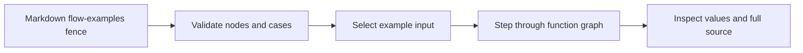

# Interactive flow examples

## System flow



## Problem overview

The existing call stack and diff views explain a PR's structure, but a reader must mentally simulate each input. That makes it hard to see when two cases branch or how a value changes between functions.

## Solution overview

An author can embed a `flow-examples` JSON fence in a walkthrough. It declares a small function graph and concrete cases. The viewer starts at the function level; the reader selects a case, moves through its recorded steps, sees input and output values, and opens the source for a node. This experiment uses authored traces. A future test recorder can emit the same data shape.

## Goals

- Let a reader compare multiple concrete inputs and their different paths.
- Show the active function, value transition, and result at each step.
- Keep full source one click away through the existing source panel.
- Make the fence usable in local, gist, and GitHub viewers.

## Non-goals

- Running arbitrary repository code in the browser.
- Automatically generating traces from tests in this iteration.
- Line-by-line debugger state.

## Important files

- [[src/flowExamples.ts#parseFlowExamples]] — Validates the authored example format.
- [[src/viewer/Fence.tsx#Fence]] — Renders fences in the document.
- [[src/viewer/SourceDiffPanel.tsx#SourceDiffPanel]] — Opens the full source behind a node.
- [[fixtures/deterministic-simulation-flow.md]] — Demo using Tandem's deterministic simulation spec.

## Implementation

### Phase 1: Define the authoring format

Parse one graph and several example traces from a fenced JSON block. Reject broken node paths or source references before sharing a document.

```callstack
 parseViewerDocument [[src/parseViewer.ts#parseViewerDocument]]
+├── parseFence("flow-examples") [[src/parseFence.ts#parseFence]]
+│   └── parseFlowExamples [[src/flowExamples.ts#parseFlowExamples]]
 └── validate source references
```

- [x] Add nodes, cases, step values, and source references.
- [x] Validate duplicate ids and broken paths.
- [x] Test parsing and document integration.

### Phase 2: Render the interactive review

Show a case picker, function graph, current transition, and playback controls. Node source links use the current Diff panel, which shows full code.

```callstack
 Fence [[src/viewer/Fence.tsx#Fence]]
+└── FlowExamplesView
    ├── choose case → first step
    ├── move through steps → highlight graph and values
    └── open node source → SourceDiffPanel [[src/viewer/SourceDiffPanel.tsx#SourceDiffPanel]]
```

- [x] Build the viewer and responsive layout.
- [x] Add a Tandem simulation example with two recorded failure paths that branch at the network fault.
- [x] Verify the build and inspect case switching, step navigation, and full code in a browser.
